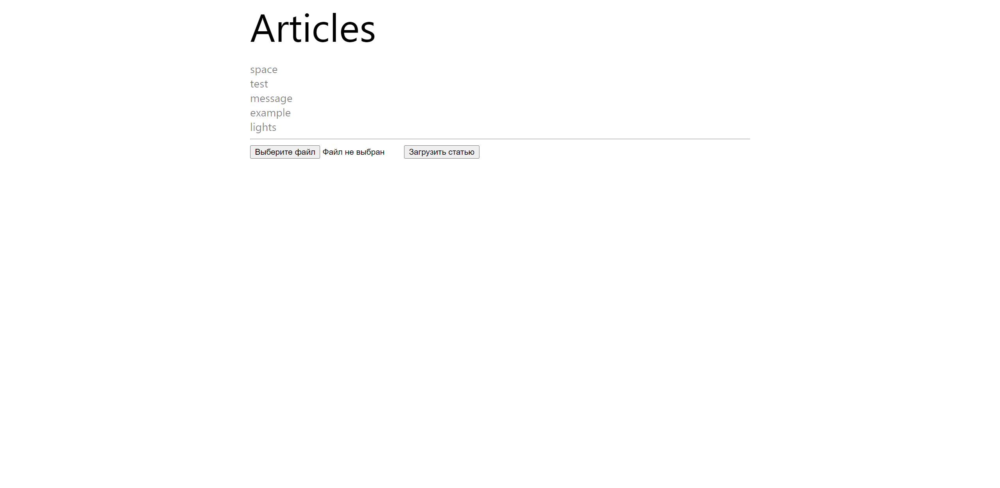
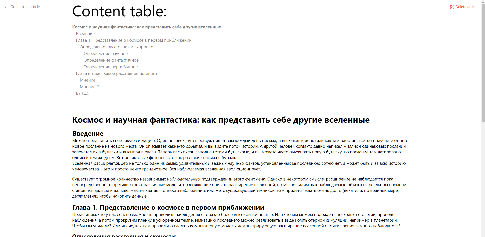

# Articles Hub Web UI

Веб-интерфейс сервиса хранения статей 

### Описание

Веб-интерфейс позволяет загружать статьи, отображать и удалять статьи на сервере [articles-hub.](https://github.com/sharphurt/articles-hub)

На основе структуры, получаемой с сервера, можно составить оглавление. Оно отображается над статьей. Каждая ссылка в нем - якорная, на соответствующую строку в статье.
### Скриншоты

### Запуск

Запустить контейнер можно с помощью с помощью docker-compose. Файл `docker-compose.yml` находится в корне
проекта. [Как использовать docker-compose.](https://docs.docker.com/compose/gettingstarted/#step-4-build-and-run-your-app-with-compose)

Серверное приложение представлено в репозитории [sharphurt/articles-hub](https://github.com/sharphurt/articles-hub).
Веб-интерфейс по умолчанию разворачивается на [localhost:3000](http://localhost:3000)

### Использованные технологии

* ReactJS 18.2.0
* npm 10.1.0